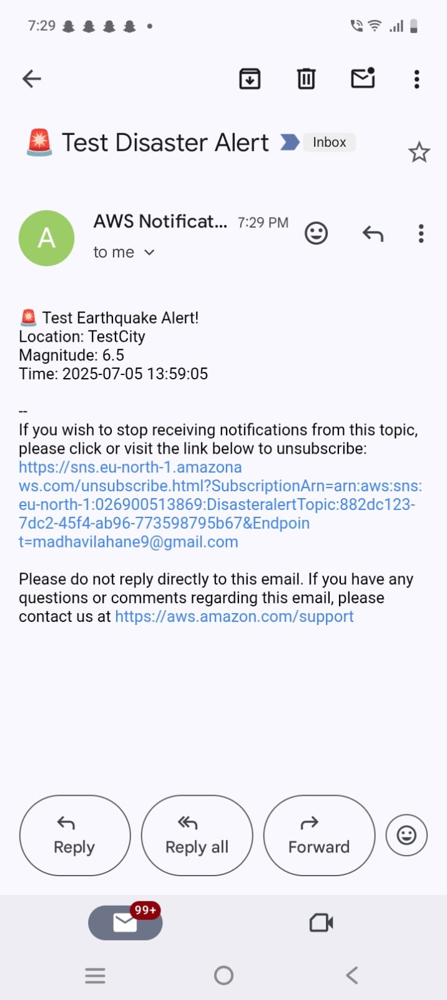
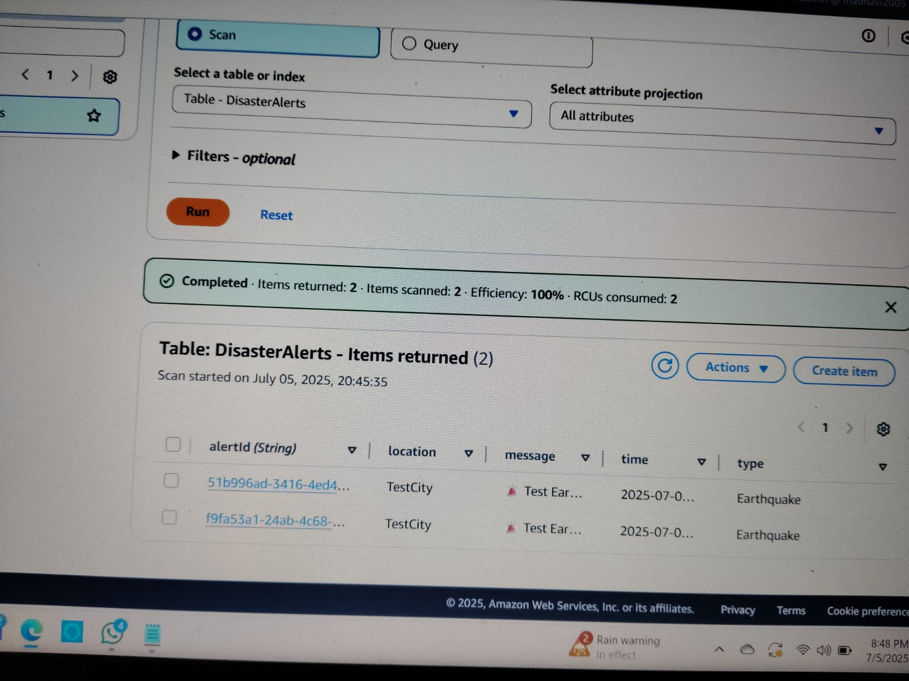
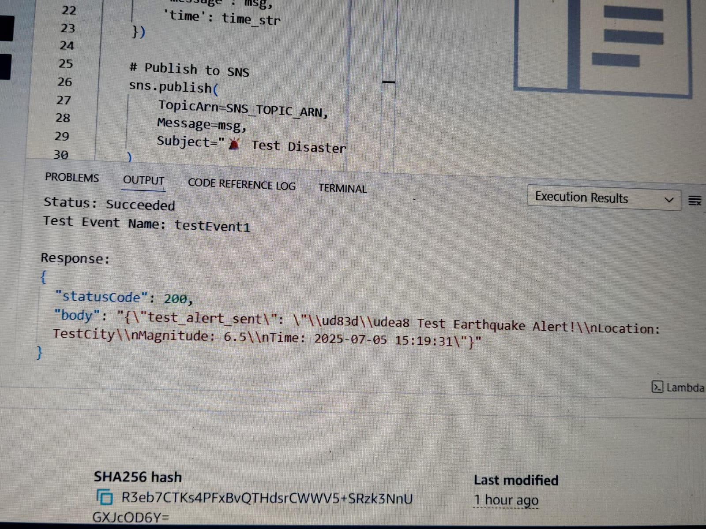

# 🛰 AWS Smart Disaster Alert System

This project detects major earthquakes in real-time using AWS services and sends instant alerts via email.

## 🚀 Tech Stack

- *AWS Lambda* – Runs Python code every hour
- *Amazon DynamoDB* – Stores earthquake alert data
- *Amazon SNS* – Sends email alerts
- *Amazon EventBridge (CloudWatch)* – Triggers Lambda every hour
- *IAM Roles & Policies* – Secure access

## 📌 Features

- Fetches real-time earthquake data from USGS API
- Stores important alerts in DynamoDB
- Sends alerts via SNS email topic
- Fully automated using CloudWatch

## 📸 Screenshots

### 📬 Email Alert Screenshot  

### 🗃 DynamoDB Table Entry  

### 🧪 Lambda Test Output  

## 📄 Created by

*Madhavi Lahane*  
BSc IT | AWS + CCNA + MCSA  
Aspiring Cloud Engineer
